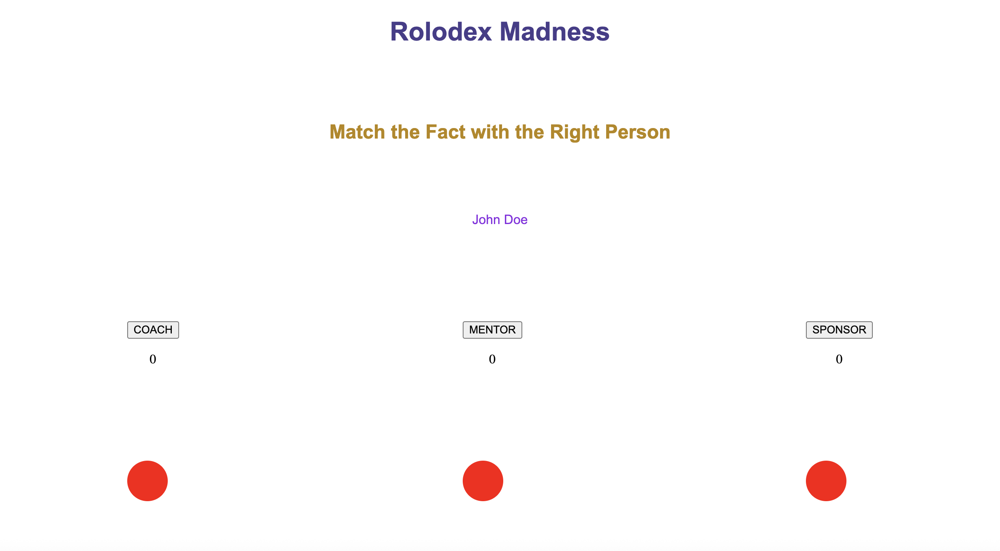

# unit1-project

Screenshot: 

Game Name: Rolodex Madness

Psychology generally states that humans can maintain at most 150 relationships. This is where large social media platforms like Facebook and LinkedIn fall short, by creating pseudorelationships and misaligning user needs with product and financial goals. In work environments, users need a solution that helps them focus on a handful of key relationships to foster development - the coach, mentor and sponsor

Getting Started: [Link]

Attributions: N/A

Technologies Used: HTML, CSS, Javascript

Next Steps:

1. Improve UI look and feel
2. Randomize fact selection
3. Improve fact functionality to allow additional facts